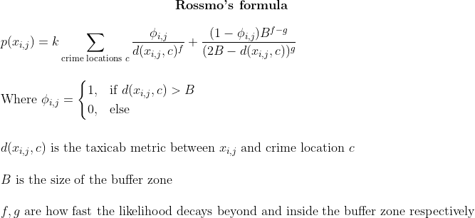

# Criminal Residence Likelihood Heatmap Generator Using Rossmo's Formula

Rossmo's formula was developed to find the likelihood of a serial criminalist's 
home location given the location of known committed crimes. The formula is
based off of the assumption that a serial criminal will avoid committing crimes
too close to their home (ie, there's a buffer zone between where they're likely
to commit crimes and where they live) and that as the distance traveled from
home increases, the effort to commit the crime increases and thus requires a
greater reward to make the crime worthwhile. In other words, criminals will 
commit crimes outside a certain area close to their home but there exists a 
limit to how far they will travel before the effort becomes not worth it.

 

Of course the limitations of this idea lie in the unpredictability  and diversity
of serial criminal behavior. The assumptions made in Rossmo's formula are not
always valid, limiting its usefulness. Still, it's fun to plot things and it 
provides one tool for apprehending serial criminals. 

I was initially exposed to this idea from the pilot episode of [Numb3rs](https://en.wikipedia.org/wiki/Numbers_(TV_series)) and 
once again after reading [Jeremey Kun's](https://jeremykun.com/2011/07/20/serial-killers/) blog on the same subject.

At the moment, the code only generates a heatmap using the Seaborn library.
In the future, I'd like to be able to generate a heatmap over actual map data 
and have points be automatically generated from a real-world location address.

Here are some sample heatmaps:

Crime Locations: {
(3, 53),
(10, 24),
(30, 10),
(40, 46),
(45, 29)
}  
B = 10  
f = 2/3  
g = 3/4  

Crime locations: {
(6, 43),
(10, 34), 
(30, 32),
(40, 36)
}  
B = 7  
f = 3/5  
g = 4/5  